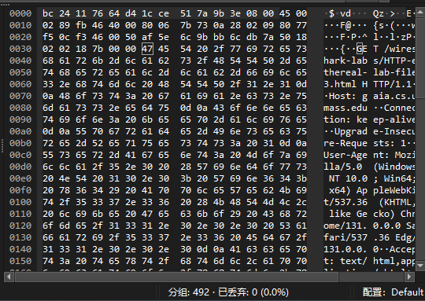
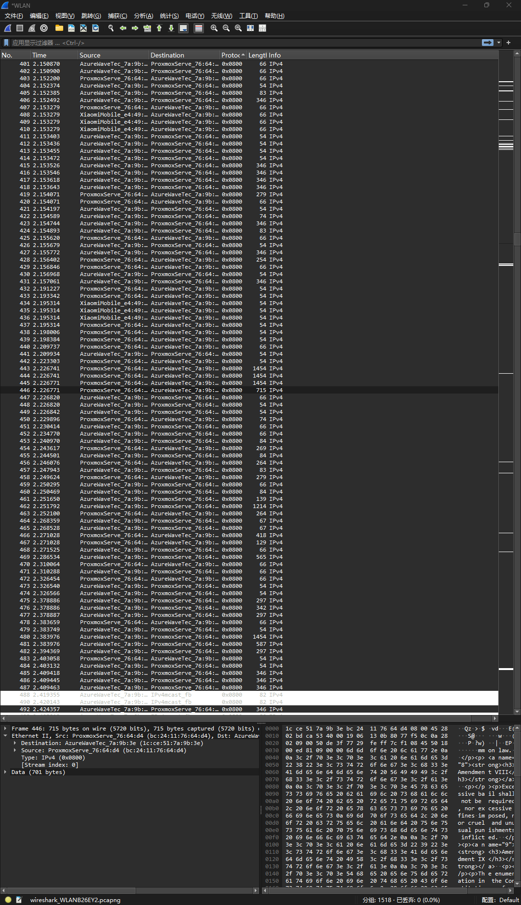
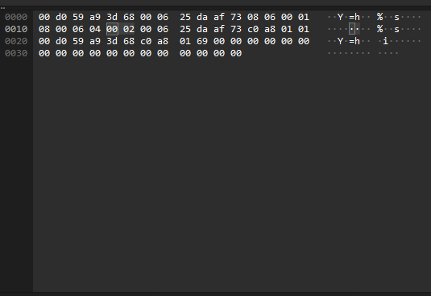

- the 48-bit Ethernet address of my computer is (1c:ce:51:7a:9b:3e)
- the 48-bit destination address in the Ethernet frame is (bc:24:11:76:64:d4)
- Is this the Ethernet address of gaia.cs.umass.edu?  obviously not
- What device has this as its Ethernet address? ProxmoxServe_76:64:d4 
- Give the hexadecimal value for the two-byte Frame type field. What upper layer protocol does this correspond to? 0x0800, IPv4

- How many bytes from the very start of the Ethernet frame does the ASCII “G” in “GET” appear in the Ethernet frame? 54 bytes

- What is the value of the Ethernet source address? Is this the address of your computer, or of gaia.cs.umass.edu (Hint: the answer is no). What device has this as its Ethernet address? bc:24:11:76:64:d4 ProxmoxServe_76:64:d4 
- What is the destination address in the Ethernet frame? Is this the Ethernet address of your computer? 1c:ce:51:7a:9b:3e yes
- Give the hexadecimal value for the two-byte Frame type field. What upper layer protocol does this correspond to? 0x0800 IPv4
- How many bytes from the very start of the Ethernet frame does the ASCII “O” in “OK” (i.e., the HTTP response code) appear in the Ethernet frame? 54 bytes
- What are the hexadecimal values for the source and destination addresses in the Ethernet frame containing the ARP request message? 00:d0:59:a9:3d:68
- Give the hexadecimal value for the two-byte Ethernet Frame type field. What upper layer protocol does this correspond to? 0x0806 ARP
- 13. Now find the ARP reply that was sent in response to the ARP request. 
- a) How many bytes from the very beginning of the Ethernet frame does the ARP opcode field begin? 

20
- b) What is the value of the opcode field within the ARP-payload part of the Ethernet frame in which an ARP response is made?
0002 (2)
- c) Where in the ARP message does the “answer” to the earlier ARP request appear – the IP address of the machine having the Ethernet address whose corresponding IP address is being queried?
00:06:25:da:af:73 192.168.1.1
- What are the hexadecimal values for the source and destination addresses in the Ethernet frame containing the ARP reply message? source: 00:06:25:da:af:73 destination: 00:d0:59:a9:3d:68